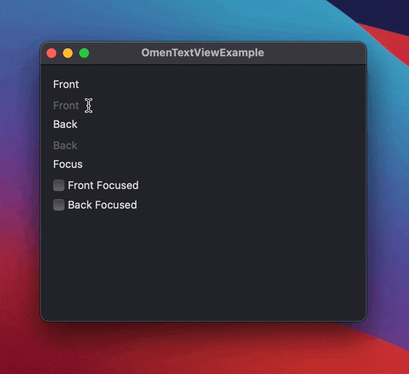

# OmenTextField

A better TextField for SwiftUI. A growing, multiline, auto-focusable TextField supporting bindable focus.

This has been pulled out of my flashcard app, [Omen](https://omen.cards)—in case you need some help memorizing SwiftUI overloads 😜



## Example

A simple example is included in the OmenTextFieldExample subproject.

```swift
import SwiftUI
import OmenTextField

public struct ExampleView: View {
    @State var frontText = ""
    @State var frontFocused = false

    @State var backText = ""
    @State var backFocused = false

    public init() {}

    public var body: some View {
        Form {
            Section(header: Text("Front")) {
                OmenTextField("Front", text: $frontText, isFocused: $frontFocused)
            }

            Section(header: Text("Back")) {
                OmenTextField("Back", text: $backText, isFocused: $backFocused)
            }

            Section(header: Text("Focus")) {
                Toggle(isOn: $frontFocused, label: {
                    Text("Front Focused")
                })

                Toggle(isOn: $backFocused, label: {
                    Text("Back Focused")
                })
            }
        }
        .animation(.spring())
    }
}
```

## Todo

- [ ] macOS support (using NSTextView)
